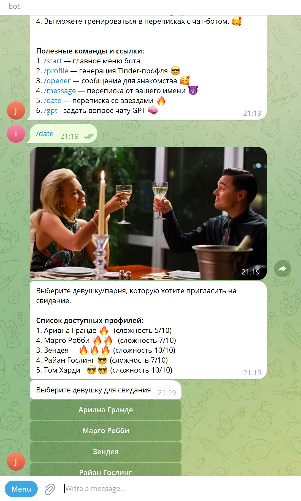

<h1> Телеграмм бот знакомств</h1>

## Описание
Версия программы: 0.0.1

## Реализованный функционал

- Генерировать Thinder-профиль по описанию
- Писать интересные и интригующие сообщения для знакомства.
- Вести переписку от вашего имени
- Вы можете тренироваться в переписках с чат-ботом

## Запуск

Клонируем проект в intellijIdea.
Он находится по адресу https://github.com/igr76/tinderBot
В классе TinderBoltApp  подставить номер API Искуственного интелекта (строка 13) и номер API телеграмм бота (строка 12)
Запускаем проект.

## Используемые технологии

- телеграмм 6.9.7.1
- chatgpt 4.3.0

## Автор проекта

- <a  href="https://github.com/igr76">Грицук Игорь</a>

